# DAML Application example: Central Bank Digital Currency (CBDC)

## Disclaimer
- This is a WIP.
- Not fullly tested for production use.

<br>

## Overview

This project has been inspired by Digital Asset "Reference Application: Central Bank Digital Currency (CBDC)". The challenge is to develop a similar application but using Daml finance library and DAML interfaces.

This project only develops the DAML model and tests for the model. UI has been discarded.

Current DAML SDK version: 2.6.0

https://github.com/digital-asset/ex-cbdc
https://docs.daml.com/daml/reference/interfaces.html

<br>
<br>

## CBDC Diagrams
<br>

### Operator.Role creation + Operator.Role invites Cb (Central Bank)
<br>

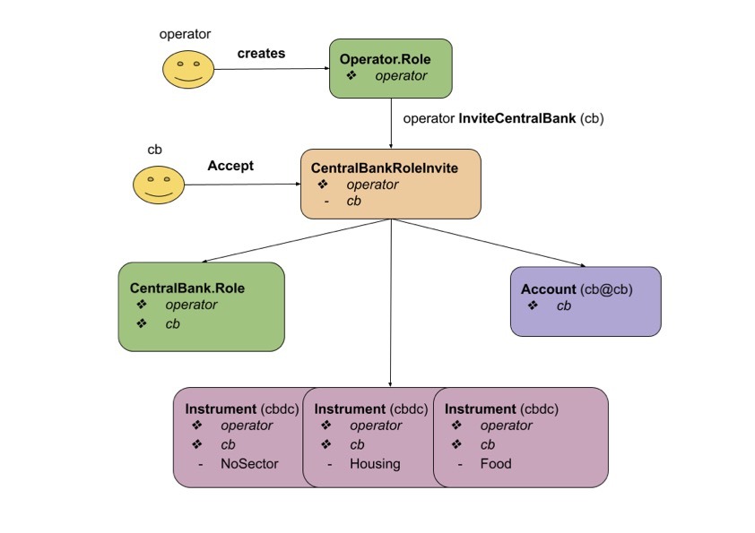

<br>

### Cb.Role invites an user.
<br>

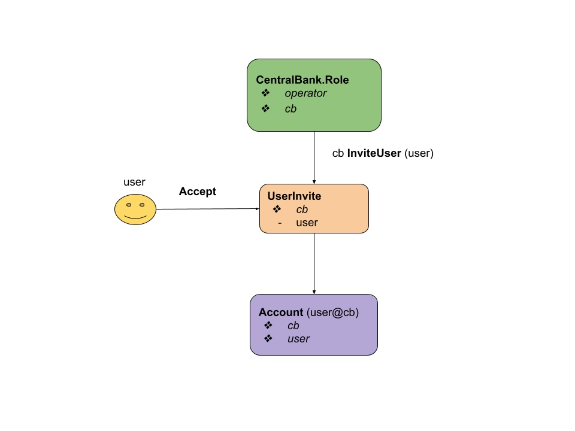

<br>
<br>

### Cb.Role issues regular cbdc.
<br>

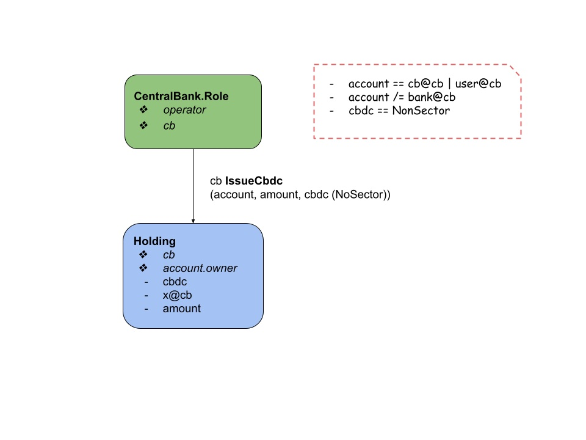

<br>
<br>

### Cb.Role issues special cbdc.
<br>

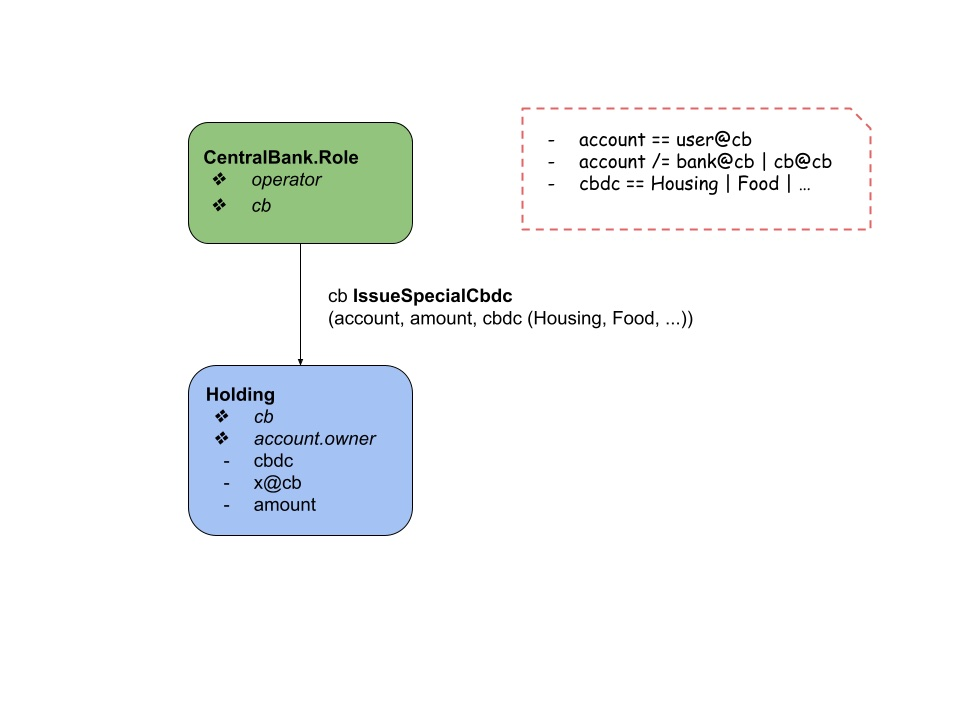


### Cb.Role invites a bank.
<br>

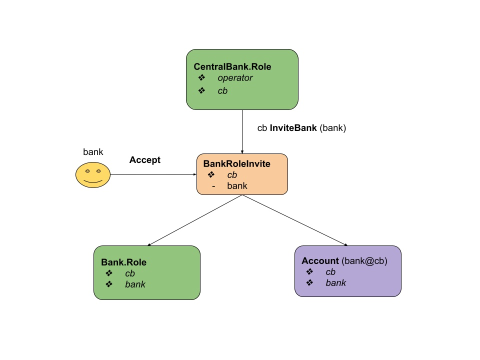

<br>
<br>

### Bank.Role requests cb cdbc injection.
<br>

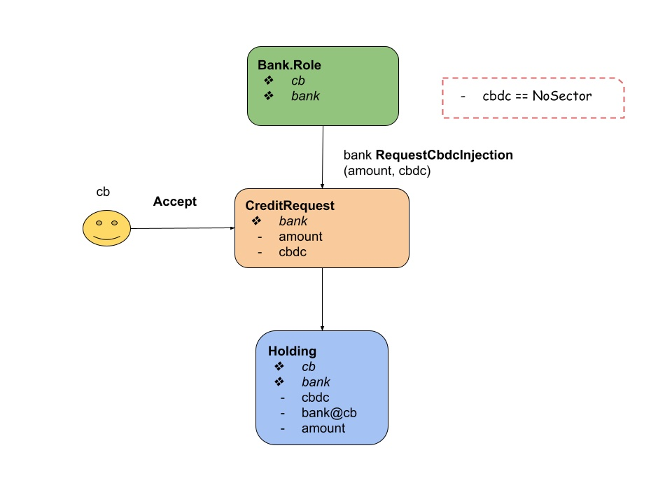

<br>
<br>

### Bank.Role requests cb cdbc extraction.
<br>

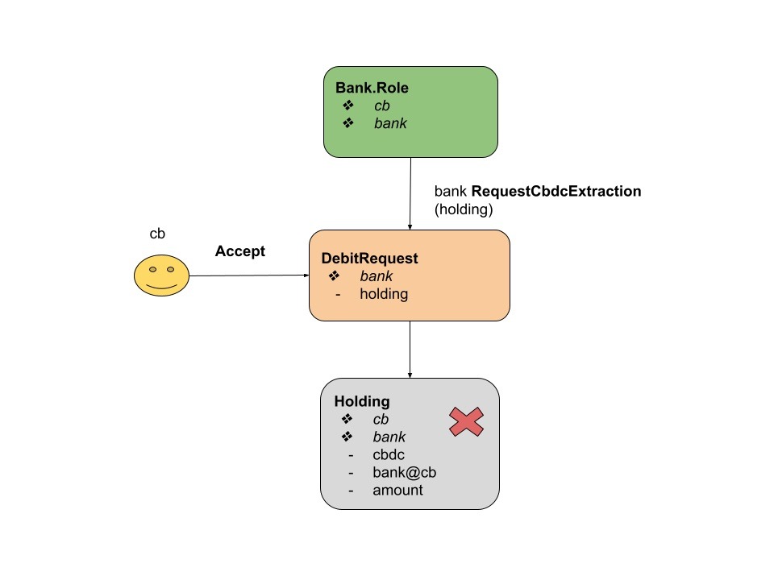

<br>
<br>

### Cb.Role invites a distributor.
<br>

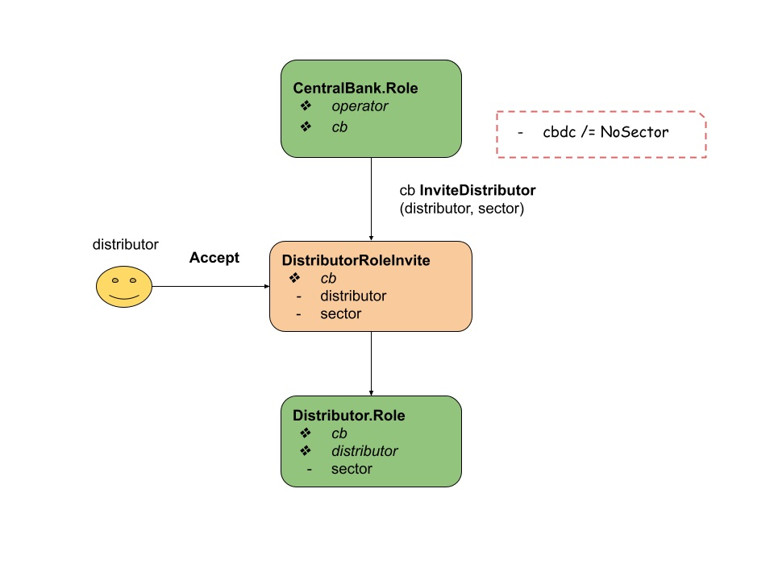

<br>
<br>

### Distributor.Role invites a provider.
<br>

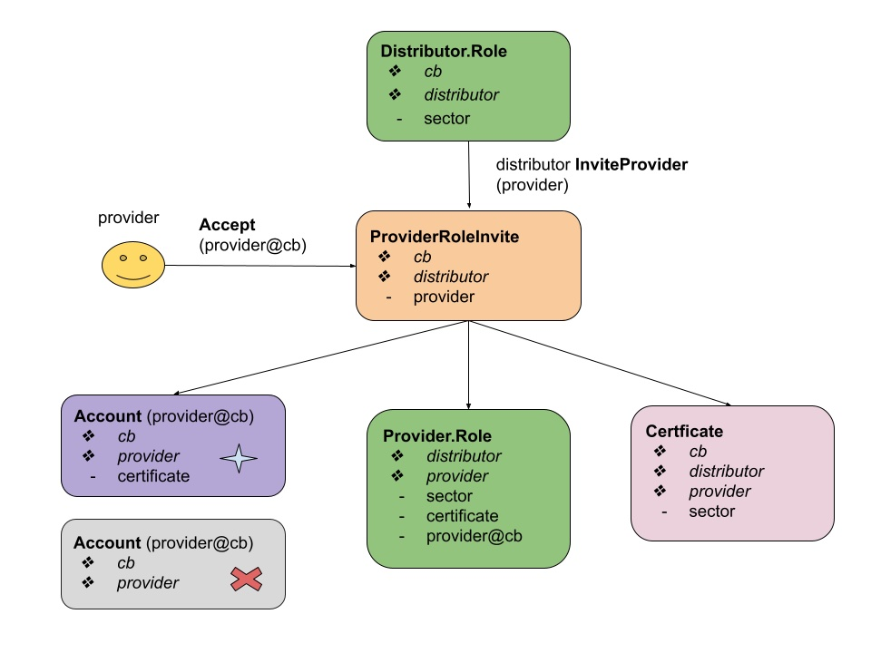

<br>
<br>

### Provider.Role creates an invoice.
<br>

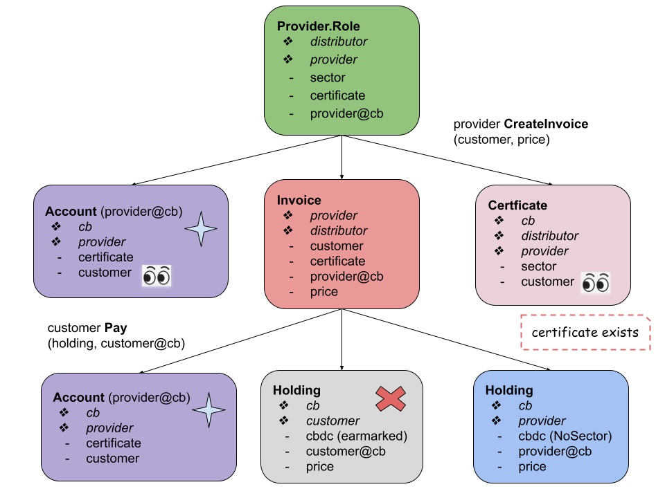

<br>
<br>

## Dependency graph
<br>

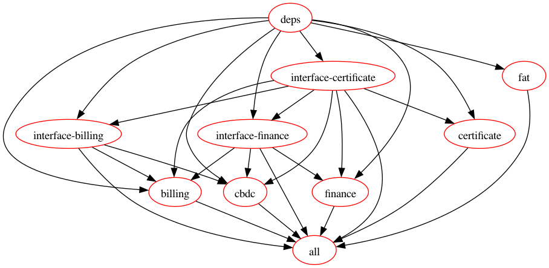

<br>
<br>

## How to build
<br>

### Build fat project
<br>

```shell
daml build -j
```

<br>

### Build packages
<br>

```shell
make
```

<br>

## How to test
<br>

```shell
daml test -j
```
